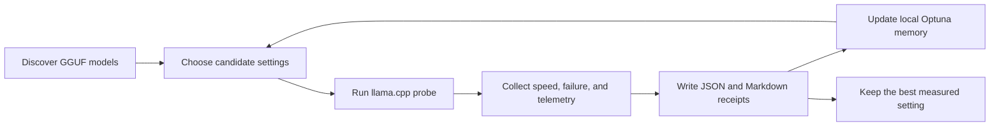

## _Agentic Pilot Autobench_

[](https://github.com/psychofanPLAYS/agent-pilot-autobench/actions/workflows/ci.yml)

Local-first benchmarking for local LLMs, GGUF models, and llama.cpp runtime settings.

Agent Pilot Autobench is a local-first evaluation cockpit for choosing, stress-testing, and deploying agent-capable local LLMs on real hardware.

### It answers a practical question with evidence instead of guesswork:

> _**Which local model and runtime settings are actually useful for agent work?**_

This repo is the public-facing home for that workflow.

Run this first:

```powershell
agent-autobench first-run
```

That command is the intended beginner entry point. The older `pilotbench`
command remains as a compatibility alias.

Short command after installing shortcuts:

```powershell
apb first-run
```

## What It Does

Agent Pilot Autobench helps you measure:

- which local GGUF model is usable behind an agent-style workflow
- which settings are faster without becoming unstable
- which candidate fails to load, OOMs, or falls back to the CPU
- which run produced the best measured score, and where the proof lives
- whether Optuna can learn from earlier attempts instead of starting blind every time

It wraps proven open-source tools instead of reinventing them:

- `llama-bench` and `llama-cli` from `llama.cpp`
- local GGUF model folders
- NVML, `nvidia-smi`, and `psutil` telemetry
- Optuna with local SQLite for persistent setting search
- Typer, Rich, and Textual for a usable CLI and TUI
- pytest for a compact but real test suite

## Why It Exists

Local model testing often collapses into guesses:

- "this one feels faster"
- "that one loaded"
- "LM Studio seemed smoother"

That is not enough when you are trying to pick a real agent pilot for work.

Agent Pilot Autobench keeps the process measurable, repeatable, and easy to inspect later. The output is meant to be useful to a human, a future run, and a reviewer on GitHub.

For the product direction behind the next public milestone, see
[docs/PRODUCT-DESIGN.md](docs/PRODUCT-DESIGN.md).

## How It Works



## Requirements

- Python 3.11 or newer
- `uv`
- GGUF models stored locally
- `llama-bench` for speed probes
- optional: `llama-cli` for workflow evaluation

## Install

From the repo root:

```powershell
uv sync --extra dev --extra bench
uvx --from lm-eval lm-eval --help
```

Run the tests:

```powershell
uv run --extra dev pytest -q
```

## First Run

The beginner command is:

```powershell
agent-autobench first-run
```

In plain English, `first-run` means:

1. Sync the local `.venv` dependencies with `uv`, including benchmark-suite
   harness wrappers.
2. Create the `agent-autobench` and `apb` command shims in `G:\_codex_global\bin`.
3. Check the model and llama.cpp paths.
4. Create the local experiment database.
5. Prepare the results folder and report files.
6. Tell you the next command instead of failing silently.

By default it does not silently change your Windows user PATH. To do that from
the terminal, run:

```powershell
agent-autobench first-run --add-to-path
```

### Easiest Windows Path

Double-click:

```text
START-HERE.bat
```

That is the start button. It runs `agent-autobench first-run`, then opens the
model picker when the checks pass.

More detail is in [docs/START-FOR-NORMAL-PEOPLE.md](docs/START-FOR-NORMAL-PEOPLE.md).

### Install The Windows Command

If you want `agent-autobench` to work from any terminal folder on Windows,
double-click:

```text
INSTALL-COMMAND.bat
```

That script creates a small command shim at `G:\_codex_global\bin\agent-autobench.bat`.
It will ask before adding that folder to your user PATH. `first-run` now creates
the same shims itself, so this `.bat` is mostly the double-click helper for PATH.
It does not change the system PATH silently.

### Easy Terminal Path

If you already know how to open a terminal in this folder, use the local command:

```powershell
.\.venv\Scripts\agent-autobench.exe first-run
```

If the local `.venv` is not installed yet, run:

```powershell
uv run --extra dev agent-autobench first-run
```

The older compatibility command also works:

```powershell
uv run --extra dev pilotbench --start
```

Check only, without opening the picker:

```powershell
.\.venv\Scripts\agent-autobench.exe --start --check-only
```

### Manual Check

The doctor command checks paths before you spend time on benchmarks:

```powershell
uv run --extra dev pilotbench doctor
```

Default Windows workstation paths live in `pilotbench.toml`:

- models: `G:\AI\models`
- LM Studio GGUF models: `G:\AI\models\LM_Studio-gguf`
- `llama-bench`: `G:\AI\llamaCPP-server\_internal\runtime\llama.cpp\llama-bench.exe`
- `llama-cli`: `G:\AI\llamaCPP-server\_internal\runtime\llama.cpp\llama-cli.exe`
- receipts: `runs\`

For a different machine, edit `pilotbench.toml`, set environment variables, or pass paths
explicitly. Precedence is:

```text
environment variables > CLI options > pilotbench.toml > built-in defaults
```

Useful environment variables:

```text
PILOTBENCH_MODEL_ROOTS
PILOTBENCH_LLAMA_BENCH
PILOTBENCH_LLAMA_CLI
PILOTBENCH_LLAMA_SERVER
PILOTBENCH_RUNS_ROOT
PILOTBENCH_DEFAULT_PRESET
PILOTBENCH_PARALLEL_MAX
```

To inspect the resolved paths as JSON:

```powershell
uv run --extra dev pilotbench doctor --json-out
```

To override paths for one command:

```powershell
uv run --extra dev pilotbench doctor `
  --root "D:\models" `
  --llama-bench "D:\llama.cpp\llama-bench.exe" `
  --llama-cli "D:\llama.cpp\llama-cli.exe" `
  --runs-root "runs" `
  --strict
```

## Common Commands

List discovered models:

```powershell
uv run --extra dev pilotbench survey
```

List Qwen models only:

```powershell
uv run --extra dev pilotbench survey --qwen-only
```

List Qwen 35B MTP candidates:

```powershell
uv run --extra dev pilotbench survey --qwen-35b-only --mtp-only
```

Open the terminal model picker:

```powershell
uv run --extra dev pilotbench start
```

Open the picker for suite-backed production-readiness runs:

```powershell
uv run --extra dev --extra bench pilotbench start `
  --benchmark-suite-plan benchmarks\plans\local-openai-smoke.plan.json
```

Show the current champion after a run:

```powershell
uv run --extra dev pilotbench results
```

Create the local experiment memory database:

```powershell
uv run --extra dev pilotbench init-db
```

List benchmark packs:

```powershell
uv run --extra dev pilotbench packs
```

Export a ready-to-edit champion deployment profile:

```powershell
uv run --extra dev pilotbench export-profile
```

Generated server profiles bind to `127.0.0.1` by default. Edit the generated PowerShell only if you intentionally want LAN or Tailscale access.

Run one autoresearch loop:

```powershell
uv run --extra dev pilotbench autoresearch `
  --model "G:\AI\models\path\to\model.gguf" `
  --budget-minutes 5 `
  --parallel-max 4
```

Run the production-readiness loop with the benchmark suite deciding the winner:

```powershell
uv run --extra dev --extra bench pilotbench autoresearch `
  --model "G:\AI\models\path\to\model.gguf" `
  --budget-minutes 20 `
  --parallel-max 4 `
  --benchmark-suite-plan benchmark-suite.plan.json
```

With `--benchmark-suite-plan`, every successful speed/TTFT attempt also runs the
general and agentic benchmark suite. The loop then optimizes by
`agent_bench_score`; raw tokens/sec is recorded, but it does not decide the
winner.

Run a focused Qwen 35B campaign:

```powershell
uv run --extra dev pilotbench autoresearch-all `
  --qwen-35b-only `
  --total-budget-minutes 30 `
  --budget-minutes 5 `
  --parallel-max 4 `
  --workflow-eval
```

## Receipts

Every run writes a folder under `runs\<timestamp>-<model-name>\`.

Important files:

- `events.jsonl`: every attempt, settings, result, telemetry snapshot, and failure class
- `summary.md`: plain-English best result
- `best-settings.json`: machine-readable winner for that run
- `learning.json`: best Optuna result when learning is enabled
- `workflow-results.json`: optional small agent-style task scores
- `recovery.json`: latest status for resuming or debugging
- `runs\leaderboard.md`: ranked cross-run champion board
- `runs\champion.json`: latest machine-readable champion

The receipt folder is the source of truth. If a model fails, that failure is still useful because the next run can avoid wasting time in the same zone.

## Beginner Presets

The TUI starts with plain-language presets:

- `Quick Scout`: does it load and look fast?
- `Normal`: good default test.
- `Deep Pilot`: serious agent pilot test, up to 20 minutes per model.
- `Overnight`: total campaign cap for longer research.

The default useful-pilot target is: TTFT under 10 seconds, generation at least 20 tok/s, full GPU offload, no swap, stable JSON/tool behavior, and the best context that preserves quality.
Autoresearch starts context probing at 4K, then climbs the ladder instead of
using an implicit default context.

## Current Score

The current fast-loop score is deliberately simple:

```text
score =
  generation_tokens_per_second
+ prompt_tokens_per_second / 100
+ context_bonus
+ workflow_score
+ serving_tokens_per_second / 10
- cold_serving_ttft_ms / 1000
```

Failed attempts receive a large negative score. That keeps the optimizer honest: a flashy setting that crashes is not a champion.
When real serving TTFT is missing, the score pays a 10-second TTFT penalty. That
keeps old speed-only receipts from looking as strong as a measured local serving
run.

The serving probe now records both first-request and warmed-up latency:

- `serving_ttft_ms`: cold first request after the server is ready
- `serving_warm_ttft_ms`: average of later requests in the same server session
- `serving_warmup_penalty_ms`: cold TTFT minus warm TTFT
- `serving_server_ready_ms`: time for `llama-server` to become healthy after launch
- `serving_cold_start_to_first_token_ms`: server launch plus first-token latency

The serving probe always uses the same ordered agent question suite by context
tier: 4K asks question 1, 8K asks questions 1-2, 16K asks questions 1-3, and
32K+ asks all 5. Each question writes one row to `runs\serving-metrics.tsv` so
cold TTFT, warm TTFT, token cache behavior, and serving speed can be charted
over time.

## Project Status

Working now:

- GGUF discovery and filtering
- heaviest-to-lightest model sorting with on-disk GB
- Qwen / parameter / quant / MTP name parsing
- llama.cpp benchmark command planning
- local autoresearch loop with budget and attempt limits
- beginner presets for quick/normal/deep/overnight runs
- benchmark pack registry with built-in pack metadata
- context-limit ladder and boundary refinement planner
- persistent Optuna learning in SQLite
- experiment-memory SQLite schema at `db\agentpilot.sqlite`
- telemetry snapshots, GPU power, swap, disk counters, and failure classification
- Markdown and JSON receipts
- Karpathy-style append-only autoresearch ledger at `runs\autoresearch-results.tsv`
- per-attempt Karpathy-style decision ledger at `runs\autoresearch-attempts.tsv`,
  including current git branch/commit metadata
- per-question serving metrics ledger at `runs\serving-metrics.tsv`
- HTML results page at `runs\results.html`
- Textual model picker with dark styling, preset panel, and run dashboard
- latest champion reporting through `agent-autobench results`
- deployment profile export through `agent-autobench export-profile`
- small workflow evaluation path
- path readiness checks through `doctor`
- real `llama-server` streaming TTFT probe through `serve-probe` and autoresearch
- executable benchmark-suite wrapper through `agent-autobench benchmark-suite`
- bundled benchmark-suite plans under `benchmarks\plans\`
- installed benchmark harness base: `inspect-ai` in the `bench` extra, with
  EleutherAI `lm-eval` invoked through `uvx --from lm-eval` so its transitive
  cache dependencies stay out of the committed project lockfile
- isolated BFCL CLI venv at `.venv-bfcl` for Python 3.11, verified with
  `.venv-bfcl\Scripts\bfcl.exe --help`
- autoresearch can consume a `--benchmark-suite-plan` and make
  keep/discard/crash decisions over `agent_bench_score`
- beginner startup through `START-HERE.bat`, `agent-autobench first-run`, and `agent-autobench --start`
- optional command shim through `INSTALL-COMMAND.bat`
- unit tests and a GitHub Actions CI workflow

Required before "production-ready":

- `docs\BENCHMARK-SUITE-PHASE.md` is now the required missing bench phase.
- Phase 0 system viability is partly implemented: explicit 4K first, then 8K,
  16K, 32K+, with fixed serving questions, TTFT, TPS, warmup penalty, cache
  evidence, and `runs\serving-metrics.tsv`.
- Phase 1 now has a command-based wrapper for general-purpose benchmark evidence
  through existing harnesses such as EleutherAI `lm-evaluation-harness`, writing
  `runs\benchmark-suite.tsv`.
- Phase 2 now has a command-based wrapper for agentic benchmark evidence through
  Inspect AI and future BFCL, SWE-bench, tau2-bench/tau3-bench, and repo-local
  deterministic agent tasks, writing `runs\agentic-suite.tsv`.
- Phase 3 now makes the autoresearch loop use Karpathy-style keep/discard/crash
  decisions over a comparable `agent_bench_score` when
  `--benchmark-suite-plan` is provided.
- A run without `--benchmark-suite-plan` is not production-ready. It remains
  system-viability evidence with labels such as `slow`, `speed_only`,
  `serving_measured`, `context_unproven`, `workflow_unproven`,
  `workflow_weak`, and `workflow_smoke`, not production-ready.

Current local smoke receipt:

- `runs\20260526-185157-benchmark-suite` is the first corrected live local
  suite receipt after the scorer fix. It failed honestly with `0.000000`, so it
  is not production-ready evidence.

Planned next:

- improve the model prompt/settings or model choice until
  `benchmarks\plans\local-openai-smoke.plan.json` produces a passing live
  receipt
- install and verify heavier SWE-bench / tau2-bench dependencies before treating
  `benchmarks\plans\external-agentic-heavy.plan.json` as more than a
  receipt-producing integration plan
- richer OpenAI-compatible `llama-server` endpoint compatibility tests
- richer final report rendering inside the TUI itself
- paired KV-cache quality comparisons
- MTP efficiency receipts
- long-context synthetic receipt, ledger, and needle grids
- BFCL-style tool-call task packs
- champion profile export as ready-to-run PowerShell scripts

## References

- [llama.cpp server docs](https://github.com/ggml-org/llama.cpp/blob/master/tools/server/README.md)
- [lm-evaluation-harness](https://github.com/EleutherAI/lm-evaluation-harness)
- [RULER long-context paper](https://arxiv.org/abs/2404.06654)
- [Berkeley Function Calling Leaderboard](https://github.com/ShishirPatil/gorilla/tree/main/berkeley-function-call-leaderboard)
- [Hermes Agent providers](https://hermes-agent.nousresearch.com/docs/integrations/providers)
- [Karpathy autoresearch](https://github.com/karpathy/autoresearch)

## License

MIT. See `LICENSE`.

## Tiny Glossary

- `apb`: short for Agent Pilot Autobench, the quick command alias.


~ _pilotBENCHY_
