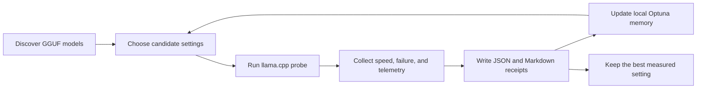

# Agent Pilot Autobench

[](https://github.com/psychofanPLAYS/agent-pilot-autobench/actions/workflows/ci.yml)

Local-first autobenchmarking for LLLMs: Local Large Language Models.

Agent Pilot Autobench is a small, practical lab for answering a simple question with evidence instead of vibes: which local model and runtime settings are actually useful for agent work?

This repo is the public-facing home for that workflow. The short command is `pilotbench`.

Legacy command: `gguf-limit-bench` still works as a compatibility alias while the project migrates to the `pilotbench` naming schema.

## What It Does

Agent Pilot Autobench helps you measure:

- which local GGUF model is usable behind an agent-style workflow
- which settings are faster without becoming unstable
- which candidate fails to load, OOMs, or falls back to the CPU
- which run produced the best measured score, and where the proof lives
- whether Optuna can learn from earlier attempts instead of starting blind every time

It wraps proven open-source tools instead of reinventing them:

- `llama-bench` and `llama-cli` from `llama.cpp`
- local GGUF model folders
- NVML, `nvidia-smi`, and `psutil` telemetry
- Optuna with local SQLite for persistent setting search
- Typer, Rich, and Textual for a usable CLI and TUI
- pytest for a compact but real test suite

## Why It Exists

Local model testing often collapses into guesses:

- "this one feels faster"
- "that one loaded"
- "LM Studio seemed smoother"

That is not enough when you are trying to pick a real agent pilot for work.

Agent Pilot Autobench keeps the process measurable, repeatable, and easy to inspect later. The output is meant to be useful to a human, a future run, and a reviewer on GitHub.

## How It Works



## Requirements

- Python 3.11 or newer
- `uv`
- GGUF models stored locally
- `llama-bench` for speed probes
- optional: `llama-cli` for workflow evaluation

## Install

From the repo root:

```powershell
uv sync --extra dev
```

Run the tests:

```powershell
uv run --extra dev pytest -q
```

## First Run

### Easiest Windows Path

Double-click:

```text
START-HERE.bat
```

That is the start button. It checks the computer and opens the model picker.

More detail is in [docs/START-FOR-NORMAL-PEOPLE.md](docs/START-FOR-NORMAL-PEOPLE.md).

### Easy Terminal Path

If you already know how to open a terminal in this folder, run:

```powershell
uv run --extra dev pilotbench --start
```

This also works:

```powershell
uv run --extra dev pilotbench start
```

Check only, without opening the picker:

```powershell
uv run --extra dev pilotbench --start --check-only
```

### Manual Check

The doctor command checks paths before you spend time on benchmarks:

```powershell
uv run --extra dev pilotbench doctor
```

On David's machine the defaults are:

- models: `G:\AI\models`
- LM Studio GGUF models: `G:\AI\models\LM_Studio-gguf`
- `llama-bench`: `G:\AI\llamaCPP-server\_internal\runtime\llama.cpp\llama-bench.exe`
- `llama-cli`: `G:\AI\llamaCPP-server\_internal\runtime\llama.cpp\llama-cli.exe`
- receipts: `runs\`

For a different machine, pass your paths explicitly:

```powershell
uv run --extra dev pilotbench doctor `
  --root "D:\models" `
  --llama-bench "D:\llama.cpp\llama-bench.exe" `
  --llama-cli "D:\llama.cpp\llama-cli.exe" `
  --runs-root "runs" `
  --strict
```

## Common Commands

List discovered models:

```powershell
uv run --extra dev pilotbench survey
```

List Qwen models only:

```powershell
uv run --extra dev pilotbench survey --qwen-only
```

List Qwen 35B MTP candidates:

```powershell
uv run --extra dev pilotbench survey --qwen-35b-only --mtp-only
```

Open the terminal model picker:

```powershell
uv run --extra dev pilotbench start
```

Run one autoresearch loop:

```powershell
uv run --extra dev pilotbench autoresearch `
  --model "G:\AI\models\path\to\model.gguf" `
  --budget-minutes 5 `
  --parallel-max 4
```

Run a focused Qwen 35B campaign:

```powershell
uv run --extra dev pilotbench autoresearch-all `
  --qwen-35b-only `
  --total-budget-minutes 30 `
  --budget-minutes 5 `
  --parallel-max 4 `
  --workflow-eval
```

## Receipts

Every run writes a folder under `runs\<timestamp>-<model-name>\`.

Important files:

- `events.jsonl`: every attempt, settings, result, telemetry snapshot, and failure class
- `summary.md`: plain-English best result
- `best-settings.json`: machine-readable winner for that run
- `learning.json`: best Optuna result when learning is enabled
- `workflow-results.json`: optional small agent-style task scores
- `recovery.json`: latest status for resuming or debugging

The receipt folder is the source of truth. If a model fails, that failure is still useful because the next run can avoid wasting time in the same zone.

## Current Score

The current fast-loop score is deliberately simple:

```text
score =
  generation_tokens_per_second
+ prompt_tokens_per_second / 100
+ context_bonus
+ workflow_score
- ttft_penalty
```

Failed attempts receive a large negative score. That keeps the optimizer honest: a flashy setting that crashes is not a champion.

## Project Status

Working now:

- GGUF discovery and filtering
- Qwen / parameter / quant / MTP name parsing
- llama.cpp benchmark command planning
- local autoresearch loop with budget and attempt limits
- persistent Optuna learning in SQLite
- telemetry snapshots and failure classification
- Markdown and JSON receipts
- Textual model picker
- small workflow evaluation path
- path readiness checks through `doctor`
- beginner startup through `START-HERE.bat` and `pilotbench start`
- unit tests and a GitHub Actions CI workflow

Planned next:

- richer OpenAI-compatible `llama-server` endpoint tests
- paired KV-cache quality comparisons
- MTP efficiency receipts
- long-context synthetic receipt, ledger, and needle grids
- BFCL-style tool-call task packs
- champion profile export as ready-to-run PowerShell scripts

## References

- [llama.cpp server docs](https://github.com/ggml-org/llama.cpp/blob/master/tools/server/README.md)
- [lm-evaluation-harness](https://github.com/EleutherAI/lm-evaluation-harness)
- [RULER long-context paper](https://arxiv.org/abs/2404.06654)
- [Berkeley Function Calling Leaderboard](https://github.com/ShishirPatil/gorilla/tree/main/berkeley-function-call-leaderboard)
- [Hermes Agent providers](https://hermes-agent.nousresearch.com/docs/integrations/providers)

## License

No license has been selected yet. Choose one before presenting this as a fully open-source project.
