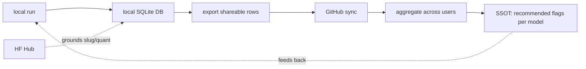

# 00 — Vision: cross-user SSOT, grounded on HF slugs

Status: draft

## The endgame

> model -> model -> database -> synced to GitHub -> aggregated from all users ->
> grounded against OEM Hugging Face slugs -> single source of truth ->
> recommended flags per model.

Today Agent Pilot produces **local receipts** (`_runs/*.tsv`, `champion.json`,
HTML reports). The vision extends this into a **shared, self-improving knowledge
base**: the more people run the librarian suite, the better the recommendations
get for everyone, per model.

## Why the HF slug is the primary key

Different users have the same model under different local filenames, folders, and
quant tags. Results cannot merge unless they share a canonical identity.

- Resolve every benchmarked GGUF to a canonical **OEM Hugging Face repo slug**
  (e.g. `Qwen/Qwen3.6-35B-A3B`) plus the specific quant artifact.
- The HF Hub tools already available in this environment can ground this:
  `hub_repo_details` / model search to confirm the canonical slug, params, and
  tags. (This is a grounding step, not a runtime dependency of the product.)
- Composite key for a result row:
  `(hf_slug, quant_artifact, llama_cpp_build, hardware_class, knob_signature)`.

This lets the SSOT answer: "for `Qwen/Qwen3.6-35B-A3B` at `Q5_K_M`, the
recommended flags / thinking mode / chat template are X" — and back it with N
independent runs.

## Data flow stages

1. **Local run** — librarian suite produces cells (Job x Knob -> Meters).
2. **Local DB** — rows keyed by the composite key above.
3. **Export** — only shareable, non-sensitive rows (see Privacy).
4. **GitHub sync** — push/pull aggregated rows (mechanism TBD: a data repo,
   GitHub releases, or a lightweight API — see open questions).
5. **Aggregate** — merge by composite key; weight by run count / agreement.
6. **SSOT** — per-model recommended flags, thinking on/off, chat template, plus
   confidence (how many users, how much agreement).
7. **Feedback** — local runs warm-start from the SSOT recommendation.

## What the SSOT recommends, per model

- best llama.cpp flag profile (extends the existing flag ladder + Optuna study)
- thinking **on vs off** for librarian work (may differ per job family)
- best chat template (froggeric v19 vs stock vs other)
- best quant for the quality/speed Pareto frontier
- which jobs the model is strong/weak at (capability profile)

## Privacy / sharing rules

Local-first stays the default; sharing is opt-in.

- Never upload prompts, retrieved memories, vault content, secrets, or transcripts.
- Share only: composite key + metric values + failure classes + hardware class +
  timing. Numbers keyed by model identity, nothing about the user's data.
- Hardware class is a coarse bucket (GPU family / VRAM tier), not a fingerprint.

## Open items

Tracked in [06-open-questions.md](06-open-questions.md): sync transport, how
hardware classes are bucketed, dedupe/merge weighting, and abuse/poisoning
resistance for crowd-sourced rows.
