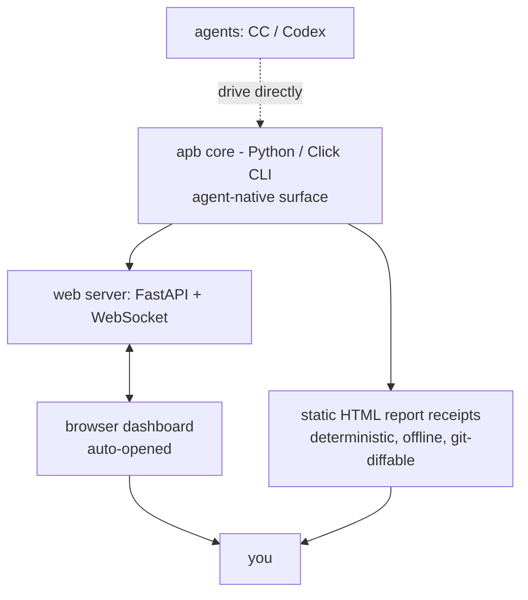

# 01 — Architecture: simple website, two-way WebSocket, CLI-first core

Status: draft

## Decision: simple website (not a TUI), Python-backed

The owner chose a **simple website** as the human surface, overruling an earlier
Textual-TUI lean. Rationale:

- The product needs **many rich graphical diagrams** (capability radars, Pareto
  frontiers, heatmaps, trend lines). A terminal grid cannot render these well;
  the web can.
- A **two-way WebSocket** gives both directions in one channel: push settings
  down to a run, stream live results/telemetry up to the page.
- It must be **effortless**: `apb` auto-opens the browser, sensible defaults, the
  user does the least possible work.

This stays Python-first. No React/Vite/TS toolchain — every extra build step is a
surface for non-deterministic failure and fights the "receipts, not vibes" ethos.

## Three roles, one core

- **Agents** drive the existing Click CLI directly. Never build a UI for agents.
- **Humans** get the website (live control + diagrams) and the static receipts.
- **Core** is unchanged in spirit: the autoresearch loop, TSV ledgers, Pareto
  recommender, and `_runs/` receipts remain the source of truth the web reads.

## Suggested stack (to validate in the plan, not locked)

- Backend: `FastAPI` + `websockets` (or `starlette`); already Python.
- Frontend: a single small static page (vanilla JS or a tiny lib), charts via an
  embedded JS charting lib **or** server-rendered SVG (matches the receipt SVGs).
- Launch: `apb` starts the server bound to `127.0.0.1`, then auto-opens the
  default browser (`webbrowser.open`). Inactivity timeout shuts it down.
- The same generated diagrams are written to disk as static HTML report receipts
  so they survive offline and diff in git.

## Two planes (still true, just both on the web now)

- **Control plane** — pick model(s)/quant, set knobs (thinking, template, flags),
  launch, monitor live. Was the Textual cockpit; now the website's control panel,
  fed by the WebSocket.
- **Results plane** — dashboards + the static report receipts. Where every
  diagram lives.

## Integration points in the existing repo

The suite plugs into machinery that already exists — reuse, do not reinvent:

- `autoresearch` loop (fixed budget, keep/discard, Optuna warm-start).
- TSV ledgers under `_runs/` (`autoresearch-attempts.tsv`, `-results.tsv`,
  `serving-metrics.tsv`, `benchmark-suite.tsv`, `agentic-suite.tsv`).
- `agent_bench_score` scoring contract — add a `librarian_bench_score`
  alongside it, composed of the new job scores (see [05-meters.md](05-meters.md)).
- The Pareto-frontier recommender (decision layer) — extend it to recommend over
  the new knobs (thinking, template) and emit per-model recommendations.
- HTML report generation (`results.html`, `report.html`) — extend with the new
  diagrams.

## What this does NOT change

- Local-first, `127.0.0.1` binding by default.
- Deterministic receipts.
- The CLI remains the contract agents and CI depend on.
