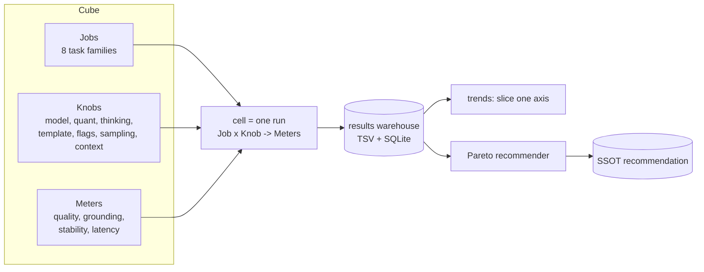

# 02 — The measurement cube

Status: draft

Every requirement in this feature collapses into one model: a 3-dimensional cube.

- **Jobs** — the discrete cognitive tasks the librarian performs. See [03-jobs.md](03-jobs.md).
- **Knobs** — every setting we can vary. See [04-knobs.md](04-knobs.md).
- **Meters** — every deterministic thing we measure. See [05-meters.md](05-meters.md).

## Definitions

- **Cell**: one benchmark run of one Job under one fully-specified Knob-setting,
  producing a vector of Meter values. This is the atomic unit of data.
- **Knob-signature**: a stable hash of the full Knob-setting. Part of the SSOT
  composite key so identical configurations merge across users.
- **Fill the cube**: run enough cells to cover the Job x Knob space of interest.
  Not always full factorial — see the sweep strategy in [04-knobs.md](04-knobs.md).
- **Slice**: hold all axes fixed but one, and read the Meter trend along it. This
  is how every "trend" chart is produced (e.g. score vs thinking on/off, or
  quality vs quant).
- **Recommendation**: the Pareto layer reads the warehouse and emits the best
  Knob-setting per Job (and overall) for a given model.

## Why this framing matters

- It makes "gather ALL conceivable data points then draw trends" a precise,
  finite engineering task instead of an open-ended wish.
- It guarantees comparability: two cells are comparable iff they differ in exactly
  the axis being studied.
- It maps cleanly onto the existing autoresearch loop (each attempt is a cell) and
  the TSV ledgers (each row is a cell).

## The warehouse

Each cell becomes one row. Reuse existing ledgers where possible and add a
librarian-specific ledger:

- `_runs/librarian-suite.tsv` — one row per (Job, Knob-setting) cell with all
  Meter columns + the composite key + receipt path.
- Mirror the keep/discard summary into `autoresearch-attempts.tsv` /
  `-results.tsv` so the existing loop and recommender see librarian cells too.
