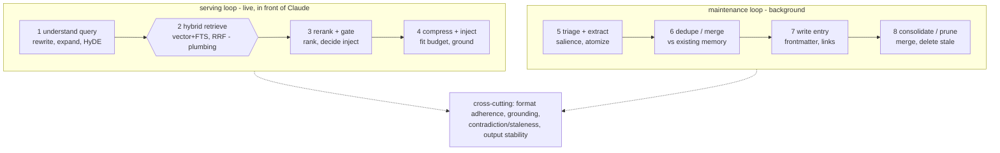

# 03 — Jobs: the librarian's atoms

Status: draft (job list pending owner confirmation — see open questions 1-3)

The librarian splits into two loops plus a cross-cutting quality layer. Teal =
model-driven jobs we score. The retrieve step is deterministic plumbing we hold
fixed and sweep as a knob, never score the model on.

## Serving loop (latency-critical — runs on every Claude request)

1. **understand query** — turn the agent's current task/context into a good
   retrieval query (rewrite, expand, HyDE). Failure starves everything downstream.
   *Measure: do the gold memories get surfaced at all.*
2. **hybrid retrieve** — vector + FTS fused with RRF. **Deterministic plumbing,
   not a model job.** Held fixed when scoring the model; its config (k, weights,
   chunk size) is a knob.
3. **rerank + gate** — re-order candidates by true relevance, and decide what is
   worth injecting at all. The **gate** is the highest-value, most-overlooked job:
   injecting irrelevant memory pollutes Claude's context and degrades it.
   *Measure: ranking quality + precision/recall of the inject/don't-inject
   decision, including correct abstention (true negatives).*
4. **compress + inject** — fit chosen memories into a token budget without
   dropping load-bearing facts and without inventing any.
   *Measure: gold-fact coverage + budget adherence + grounding.*

## Maintenance loop (quality-critical, latency-tolerant)

5. **triage + extract** — decide if an incoming log/lesson is worth keeping, then
   atomize it into clean discrete memories.
   *Measure: salience classification + extraction completeness.*
6. **dedupe / merge** — already known? merge vs create-new.
   *Measure: precision/recall against a labeled duplicate set.*
7. **write entry** — emit a schema-conformant memory: exact frontmatter, valid
   `type` (user/feedback/project/reference), correct `[[wikilinks]]`.
   *Measure: schema validation — fully deterministic.*
8. **consolidate / prune** — merge overlapping memories, delete wrong/stale ones
   (the existing consolidate-memory job, run by the local model).
   *Measure: merged the right ones, deleted only the truly stale.*

## Cross-cutting (scored on every job above)

- **format adherence** — exact output contract (JSON tool calls, frontmatter).
  The thing froggeric-v19-vs-stock and thinking-on-vs-off move most.
- **grounding** — no facts absent from the source / retrieved set.
- **contradiction & staleness** — recognize when new info invalidates old.
- **output stability** — same input, same output across N repeats. Its own meter,
  and where thinking-on can *hurt* (more variance) — a key trend to surface.

## Deliberate exclusions (so we measure the right thing)

- Embedding generation — that's the embed model, not the chat model. Held fixed.
- The RRF math — deterministic. Held fixed, swept as a knob.

## Pending confirmation (see [06-open-questions.md](06-open-questions.md))

- Q1: is the inject/don't-inject **gate** model-driven, or always top-k?
- Q2: does the model do **query understanding / HyDE**, or does raw task text go
  straight to retrieval?
- Q3: any job missing — auto-linking, write-time retrieval summaries, self-confidence?
